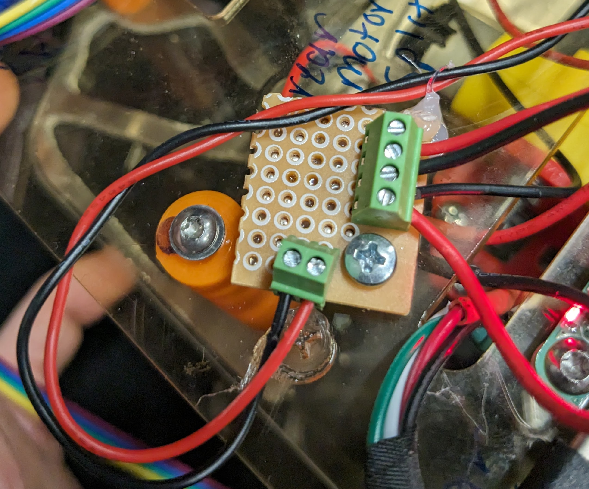
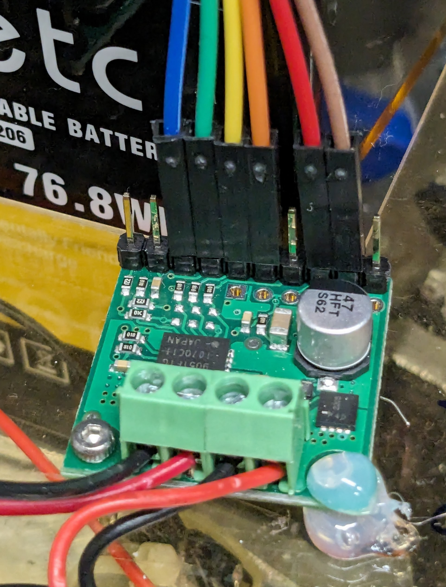
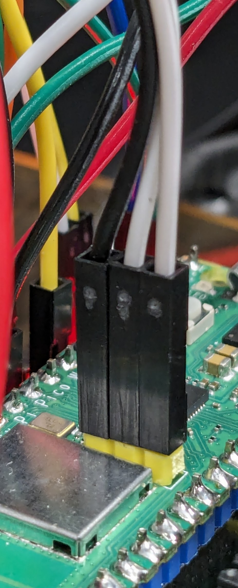
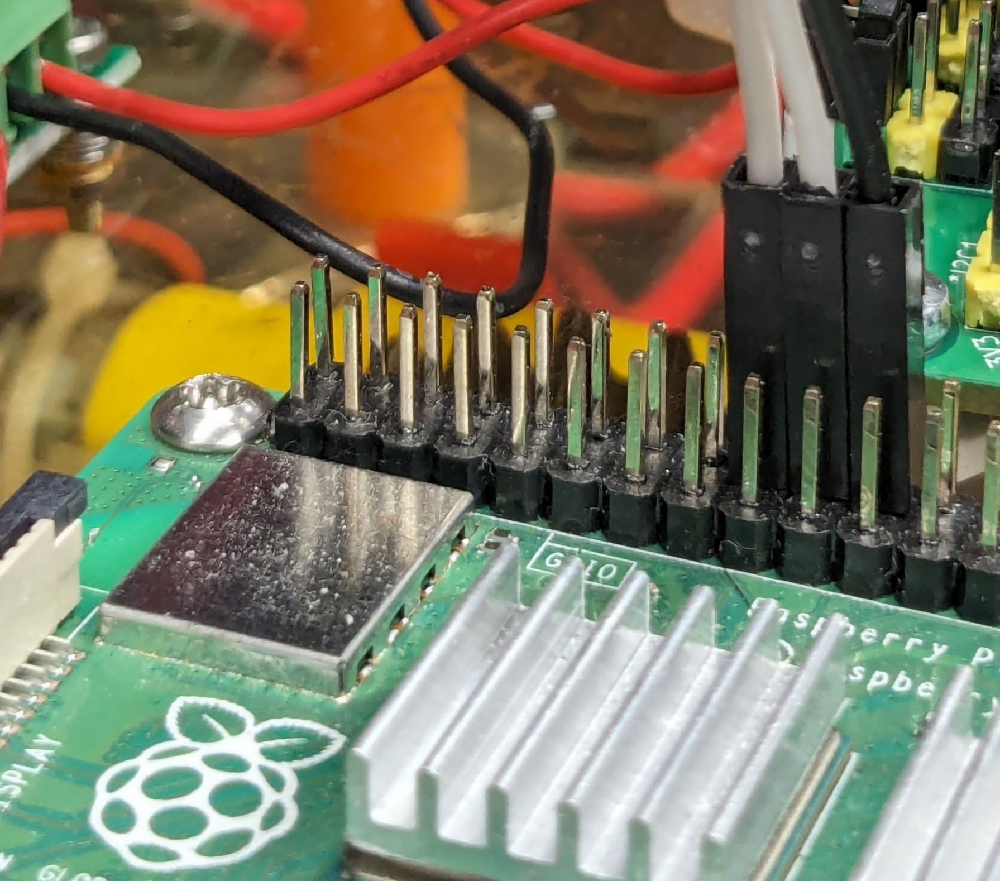

# Building Her
For mechanical notes... ask Jeannette.

## Rear Motors
Ensure the rear motors are connected to their motor controller with opposite
polarity (i.e., ensure the black lead of one motor is connected to the red lead
of the other), and connect the joined leads to the output of the motor
controller. The polarity (if wrong) will be corrected in a later step. One way
to do this neatly is to have a splitter after the motor controller (input on
the bottom, output on the right):

## Steering Motor

The steering motor has six wires coming out of it -- two for power, four for
the encoder control. Those hook up to the Pico as follows (indexed by color):

| Color | Function | Connect To |
| --- | --- | --- |
| red | motor power | motor controller output |
| black | motor power | motor controller output |
| blue | encoder power | +3.3 V |
| green | encoder ground | pico ground |
| yellow | encoder signal | pico pin 2 |
| white | encoder signal | pico pin 3 |

## Motor Controllers

Connections for the motor drivers will be referenced to... the following photo,
as it's much easier to talk about colors than about pin numbers when you can't
actually see the pin numbers written on the board.

**Note:** the right side of the green terminal block connects to controller
power (red positive, black ground), and the left side of the block is the
output.

### Steering Motor Controller

| Color | Function | Connect To |
| --- | --- | --- |
| red | logic power | +5 V |
| brown | logic ground | pico ground |
| orange | enable | pico pin 4 |
| yellow | ~enable | pico ground |
| green | polarity | pico pin 5 |
| blue | polarity | pico pin 6 |

### Rear Motor Controller

| Color | Function | Connect To |
| --- | --- | --- |
| red | logic power | +5 V |
| brown | logic ground | pico ground |
| orange | enable | pico pin 11 |
| yellow | ~enable | pico ground |
| green | polarity | pico pin 12 |
| blue | polarity | pico pin 13 |

## Rear Encoders

The rear encoders each have four wires coming out of them, which connect as
follows.

### Right Rear Encoder

| Color | Function | Connect To |
| --- | --- | --- |
| red | encoder power | +3.3 V |
| black | encoder ground | pico ground |
| green | encoder output | pico pin 7 |
| white | encoder output | pico pin 8 |

### Left Rear Encoder

| Color | Function | Connect To |
| --- | --- | --- |
| red | encoder power | +3.3 V |
| black | encoder ground | pico ground |
| green | encoder output | pico pin 9 |
| white | encoder output | pico pin 10 |

## Single Wire Debug

These connections are hard to describe, so just take a look at the following
pictures. Note that the order of the wires is flipped between the two, and that
the wires are plugged into the Pi on outside GPIO pins 9, 10, and 11.

